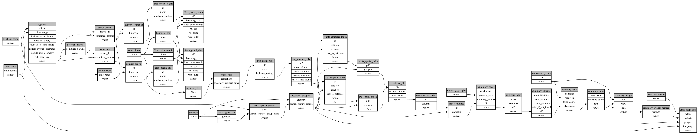

```
# AUTOGENERATED BY ECOSCOPE-WORKFLOWS; see fingerprint in README.md for details

```

```yaml
# fingerprint:
artifacts_sha256_basic: 79cd80ff1dcdf77535b74a17f6f59966daf8b98d26434199cf0454694cf1f28f
artifacts_sha256_strict: 8bea7ae7198719f151399a8b18cdcae23de79409c15a17caebb36466d1fcd8de
installed_requirements:
- channel: conda-forge
  name: python
  version: {version: ==3.12.13}
- channel: https://repo.prefix.dev/ecoscope-workflows/
  name: lonboard
  version: {version: ==0.0.8}
- channel: conda-forge
  name: numpy
  version: {version: ==2.0.2}
- channel: conda-forge
  name: pyarrow
  version: {version: ==23.0.1}
- channel: conda-forge
  name: rasterio
  version: {version: ==1.4.4}
- channel: conda-forge
  name: pydeck
  version: {version: ==0.9.2}
params_sha256: b3623e15fa5687b09636844dfdeb64183b9f460d099779de9184e3808c78a83d
spec_sha256: 9954721f8663494d7ad687980342872c05f4bbef2e85428652fe53a35202b25d

```

# ecoscope-workflows-patrol-encounter-rate-stats-workflow


