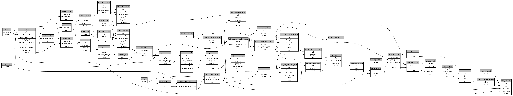

```
# AUTOGENERATED BY ECOSCOPE-WORKFLOWS; see fingerprint in README.md for details

```

```yaml
# fingerprint:
artifacts_sha256_basic: 0b39b67a6b658c58eb55763650af881ad7a682da49d209be6773b681b613eba9
artifacts_sha256_strict: 7de0f433fa86054d3a109a5ffe74400da44f5c32c8d0a96e1034003bc4174962
installed_requirements:
- channel: https://repo.prefix.dev/ecoscope-workflows/
  name: ecoscope-platform
  version: {version: ==2.23.0}
- channel: conda-forge
  name: pydeck
  version: {version: ==0.9.2}
params_sha256: ebf541937db20e7e7725caec6d6183ad1e87574fa7d4fe5eefa46e3dfaebd96d
spec_sha256: e95591b2443efd1336a6212ff495078eb858ee856d6c3105ba9958ec5e186d89

```

# ecoscope-workflows-patrol-encounter-rate-stats-workflow


